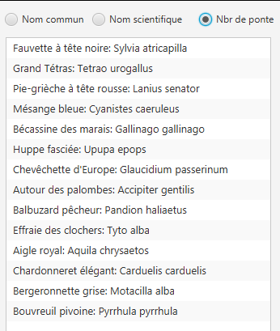

# Évaluation E1 Ornithologie

## Objectifs

 Dans le cadre d'une application réaliste en Java, vous prouvez votre maîtrise des différents sujets du module 320.

 Objectifs spécifiques :

- Comprendre l'utilité et les fonctionnalités de l'application présentée
- Comprendre et respecter l'architecture MVC
- Implémenter avec l'utilisation des principes POO (interface, héritage, ...)
- Compléter le code manquant par la lecture des schémas UML et de la javadoc fournis.
- Résoudre des problématiques de tri et d'indexation grâce aux structures de données dynamiques.
- Documenter certaines parties du code avec la javadoc
- Tester l'application avec des tests unitaires

## Durée

- **200'** 

## Fonctionnalités de l'application

Cette application `Ornithologie`, utilisant certaines données du site vogelwarte.ch, est hypothétique mais réaliste.

Elle propose à l'utilisateur une liste (restreinte) des espèces d'oiseaux de Suisse. Pour chaque espèce, une description est disponible ainsi qu'une image.

Elle contient également des observations (fictives) réalisées sur ces espèces d'oiseaux, et donne la possibilité d'enregistrer de nouvelles observations.

Voici l'image de l'application (lorsque vous aurez réalisé toutes les fonctions)


Listes des fonctions spécifiques offertes à l'utilisateur:

  Partie centrale :
  - Visualisation d'une liste d'espèce
  - Affichage des détails de l'espèce (image, répartition, description, caractéristiques, ...) lorsque l'espèce est sélectionnée dans la liste
  - Tri par nom scientifique de la liste à l'ouverture de l'application
  - Tri possible par nom commun ou nombre de ponte/durée d'incubation

Partie du bas à gauche :
- Visualisation d'une liste des observations effectuées
- Affichage du détail de l'observation lorsqu'elle est sélectionnée dans liste
- Fonction de filtrage des observations: 
  - aucun filtrage
  - par date (la date est sélectionnée dans un calendrier)
  - par nom commun (la liste du nom commun des espèces est proposée)
  - par date et nom commun
- Affichage du nombre d'observations selon le filtre effectué.
- Activation automatique du filtre par nom lors de la sélection d'une espèce dans la partie du haut.
  
Partie du bas à droite :
- Enregistrement d'une nouvelle observation
  - sélection de l'espèce dans un liste
  - sélection de la date dans un calendrier
  - entrée libre du lieu (contrôle que ce champ soit rempli)
  - entrée libre de l'auteur (contrôle que ce champ soit rempli)
- Possibilité d'enregistrer plusieurs observations identiques


## Organisation de votre travail

Vous devez en premier lieu bien comprendre le contexte de l'application et les fonctionnalités ci-dessus fournies par l'utilisateur. 

Ensuite, à l'aide la documentation ci-dessous, du code et de la javadoc fournis, **vous identifiez qu'elle partie du code vous devez produire afin d'offrir à l'utilisateur toutes ces fonctionnalités**

Le choix de l'ordre dans lequel vous effectuerez votre travail fait partie de vos compétences. Cependant, afin vous aider nous vous fournissons une proposition chronologique du travail à effectuer, à la fin de ce document.

N'oubliez pas les points concernant la javadoc et les tests à la fin de ce document.

Essayez néanmoins d'obtenir rapidement une application compilable, afin de pouvoir ensuite travailler pas à pas.

Toute la partie qui concerne directement l'affichage (view.fxml et view.java) et déjà réalisée et ne doit pas être modifiée.

## Architecture du projet (packages)

Pour savoir où créer les classes du projet, voici une vue d'ensemble des packages du projet Java et leur contenu :


## Vue d'ensemble UML des classes du projet - le pattern MVC


## Détail des classes du projet


### Service de formatage des date

Vous devez compléter les méthodes du service ci-dessous à l'aide de la javadoc fournie.


Ce service est directement utilisé par la classe view.java et non par le controller.


### Service de chargement des espèces

Ce service est fourni et vous n'avez aucune modification à y apporter.


### Service d'indexation des espèces

Vous devez compléter les méthodes du service ci-dessous à l'aide de la javadoc fournie.


### Service de tri des espèces

Vous devez compléter les méthodes du service ci-dessous à l'aide de la javadoc fournie.


### Service de journal des observations

Vous devez compléter les méthodes du service ci-dessous à l'aide de la javadoc fournie.


La méthode `getListObservations` vous demande une liste triée (voir la javadoc). Soyez attentif au type de structure utilisée. En effet, plusieurs observations peuvent être enregistrées le même jour.

### Service d'indexation des observations

L'interface ci-dessous est fournie ainsi que la javadoc précise des méthodes à réaliser.  
Veuillez réaliser le service correspondant :

Soyez attentif à deux méthodes qui se ressemblent : `indexerObservations` et `indexerObservation`.

L'application à besoin de ces deux sevices, car d'une part elle charge (et donc doit indexer) une liste d'observations à 
l'initilisation de l'application, et d'autre part elle peux enregistrer de nouvelles observations (qui doivent également être indexées). Dans le but d'éviter de la duplication de code, la méthode `indexerObservation` va parcourir la liste initiale et appeler `indexerObservation` sur chaque entrée.

Le code vous est  fourni, et déjà complété dans le fichier java du service:

```java

    public void indexerObservations(ArrayList<Observation> listObservations) {
        for (Observation observation : listObservations) {
            indexerObservation(observation);
        }
    }

```

La méthodes `getObservationParNomCommun` vous demande une liste triée (voir la javadoc). Soyez attentif au type de structure utilisée. En effet, plusieurs observations peuvent être enregistrées le même jour.


### Vue d'ensemble des classes Espece et EspeceDetail


#### Indications utiles pour l'implémentation de `Espece et EspeceDetail`

Comme expliqué ci-dessus, vous observez bien le schéma pour créer les méthodes manquantes nécessaires au fonctionnement de l'application.

Voici quelques pistes/éléments :

- Une méthode toString sera utilisée par la View.java et doit renvoyer le nom commun suivi de `:` et suivi du nom scientifique.

- une méthode compareTo doit être implémentée. Elle doit permettre de trier les espèces par nom scientifique.

- on ne doit pas pouvoir créer un objet de la classe Espece
- l'ordre des paramètres dans le constructeur doit être respecté, car des observations sont instantiées par le sevice `ServiceChargementEspeces`.

## ObservationBase et Observation


#### Indications utiles pour l'implémentation de `ObservationBase`

1. La méthode `toString` doit renvoyer la date et l'auteur, séparé par un  / .
2. La méthode compareTo doit être implémentée selon les besoins de l'application. C'est à dire selon les tris demandés par les méthodes getObservationsParNomCommun et getObservationsParNomCommunEtDate.


#### Indications utiles pour l'implémentation de `Observation`

1. La méthode `toString` doit renvoyer la date et le nom commun, séparé par un  / .


### Détail de la classe `Application`

Voici les indications manquantes qui vous permettront de terminer l'implémentation de cette classe :

#### Méthode `main()`

```mermaid
sequenceDiagram
    create participant Controller
    main()->>Controller: <<creation>>
    main()->>+Controller: start()
    Controller-->>-main(): 
```

### Détail de la classe `Controller`

Voici les indications manquantes qui vous permettrons de terminer l'implémentation de cette classe déjà fournie mais de manière incomplète :

#### Méthode `start()`

```mermaid
sequenceDiagram
    start()->>+view: start()
    view-->>-start(): 

```

Voici encore deux diagrammes de séquence qui vous permettront de coder les deux dernières méthodes de la classe Controler, les méthodes `actionChargerObservationsParEspeceEtDate` et  `actionAjouterObservation`.

#### Méthode `actionChargerObservationsParEspeceEtDate()`


#### Méthode `actionAjouterObservation`


## Javadoc

Le service `ServiceFormatageNomOiseau` possède une méthode `formatterNomOiseau`.

Vous devez transformer le cachier des charge ci-dessous en Javadoc.

Voici le cahier des charge de cette méthode: 

En paramètre, la méthode doit accepter un nom d'oiseau, composé de deux mots, séparé par un espace.
Par exemple Mésange bleue. On aimerait que cette méthode transforme ces mots, afin que toutes les lettres soient en minuscules. Il faudrait également remplacer l'espace entre les deux mots par un underscore `_`. Si les deux mots ne sont pas séparés par un espace, ou si l'entrée ne contient aucun caractère, la méthode devra retourner `entrée incorrecte`.

- Vous générez ensuite la javadoc pour le projet complet.

## Tests unitaires

  -  Sur la base de votre Javadoc écrite selon le paragraphe précédent, vous codez la méthode  `formatterNomOiseau`.

   - Ensuite vous mettez en place un test unitaire, avec tous les pas de test nécessaires selon la théorie vue durant le module.
   - Vous exectuez ensuite ces tests unitaires et corrigez si besoin votre code en fonction des résultats des tests.
  
## Résultats à obtenir (Tests fonctionnels)

Afin de vous aider à contrôler certains de vos résultats, voici ce que vous devez obtenir:

### Pour la partie du haut espèces

- Lors d'un tri par ponte et durée de séjour au nid



- Pour les autre tris, vous effectuez un contrôle vous-même.


## Pour la partie du bas observations

- Lorsque aucun filtre n'est sélectionné 


- Lorsque que le filtre par Nom est sélectionné sur Autour des palombes


- Lors d'un filtre au 2 septembre 2024 pour la Bécassine des marais 


- Lorsque vous ajoutez une observation, elle doit apparaître en premier dans la liste ci-dessus.


 

# Proposition chronologique des tâches à effectuer

Ceci est une proposition parmi d'autres solutions possibles.

-	Classe Application pour faire le main() //
-	Service de formatage des dates //
-	Classes ObservationBase et Observation //
-	Classes Espece et EspeceDetail //
-	Service de tri des espèces //
-	Classe Controller //
-	Service de journal des observations //
-	Service d'indexation des especes //
-	Service d'indexation des observations //
-	Javadoc
-	Tests unitaires


# Critères d'évaluation

| Note | Explications |
| :----: | :---- |
| **1** | **`Pas rendu / tricherie`** |
| **2** | **`Loin d'être suffisant`**<br>Le travail rendu mets en évidence de **nombreuses et profondes lacunes**. |
| **3** | **`Insuffisant`**<br>Le travail rendu mets en évidence des **difficultés/lacunes qu'il faut encore résoudre** pour atteindre le minimum syndical. |
| **4** | **`Suffisant`**<br>Le travail rendu démontre que le **minimum requis est atteint** (compréhension et capacité de mettre en oeuvre correctement).<br>Le travail rendu démontre également qu'il subsiste un **manque d'aisance** et que **plusieurs petites et moins petites erreurs ont été commises**. |
| **5** | **`Bien`**<br>Le **travail rendu est bon** tant au niveau compréhension que capacité de mettre en oeuvre correctement.<br>**Trop de petites et moins petites erreurs ont cependant été commises**. |
| **6** | **`Très bien`**<br>Le **travail rendu est excellent** et de grande qualité tant au niveau compréhension que capacité de mettre en oeuvre correctement.<br>**BRAVO !!!** |
